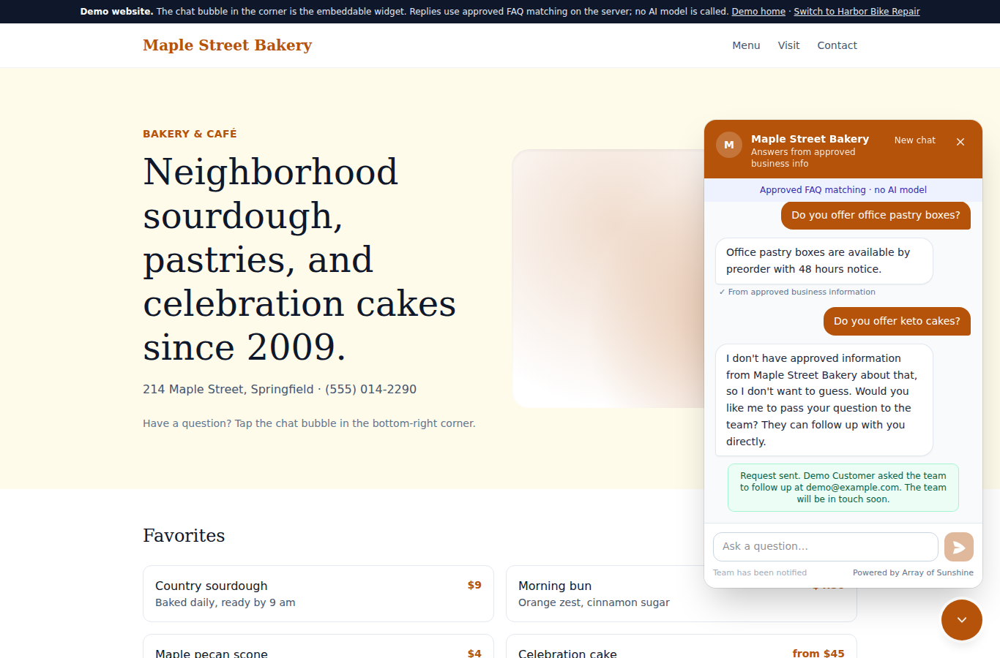
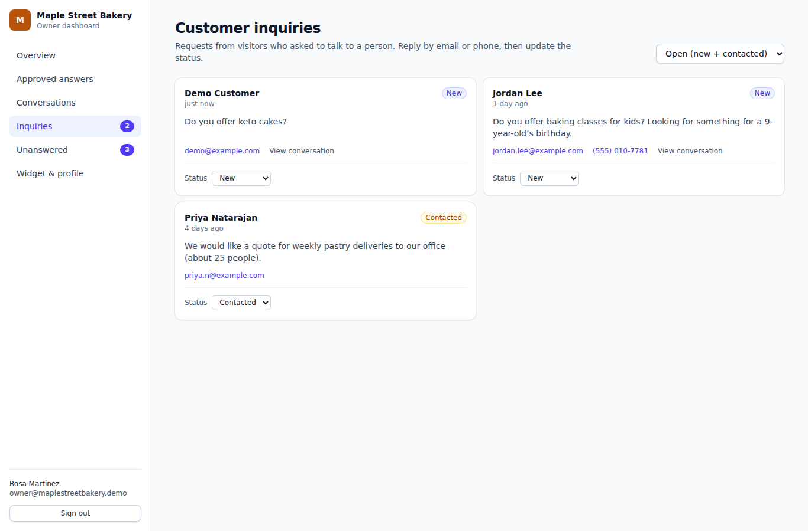

# Array of Sunshine Support — full-stack customer support app

A React/TypeScript frontend connected to a real Node.js HTTP backend and persistent SQLite database.
Business owners sign in with a password, manage approved FAQs, read conversations, and follow up
on inquiries. Visitors use a chat widget that answers from approved information or offers human handoff.

**The default app runs on your own computer without paid services, AWS credentials, or model calls.**
The assistant uses deterministic FAQ matching, not a generative AI model. Real authentication and
server-side persistence are implemented. This is a local portfolio application, not a production-hosted service.

## Local demo

Captured with the real Node.js API and SQLite database using fictional sample data. No cloud services or AI model calls are used.

[Watch the short FAQ-to-handoff walkthrough](docs/demos/walkthrough.mp4) · [Repeat the walkthrough](docs/DEMO.md)

**Visitor: approved answer followed by a human handoff**



**Owner: the saved customer inquiry after a refresh**



## Run on Windows PowerShell

Requires **Node.js 24** and npm (SQLite is built into Node). No separate database installation.

```powershell
git clone https://github.com/mustafa-sarwari/array-of-sunshine-support.git
Set-Location array-of-sunshine-support
npm ci
npm run dev
```

If you already have the project:

```powershell
Set-Location "D:\AWS Project"
git pull --ff-only
npm ci
# Clear an old shell setting that selected the browser-only demo.
Remove-Item Env:VITE_BACKEND -ErrorAction SilentlyContinue
npm run dev
```

If an existing `.env.local` sets `VITE_BACKEND=local`, change it to `server` or remove that line.
Open **http://localhost:5173/**. This command starts Vite and the real backend on port 3001.
Stop old servers on those ports first (Ctrl+C in their terminal). Closing the new terminal stops both.

On the first backend startup, the terminal prints a randomly generated password for each fictional
sample owner. Save those passwords locally; they are shown only once:

- `owner@maplestreetbakery.demo`
- `owner@harborbikes.demo`

Use those credentials on the Owner sign-in page, or click **Create account** to register your own
business with an email and a password of at least 12 characters. Registration gives you a private
recovery code. Save it: **Recover account** uses that code instead of sending email. Recovery rotates
the code and revokes all sessions. Settings → Account security lets you change your password and
create a fresh recovery code. Existing sample owners can obtain a recovery code by changing their
password after signing in. There is no one-click authentication bypass.
Passwords are stored as salted scrypt hashes; session cookies are HttpOnly and SameSite=Strict,
expire after eight hours, and are revoked at sign-out. Session tokens are hashed in SQLite.

The database is created at `data/support.sqlite`, excluded from Git. It contains private conversations
and credentials; do not commit it. To reset this fictional local dataset and generate new passwords,
stop the server and delete the `data` folder, then restart. **This deletes the saved local data.**

## Features

- Password sign-in, server sessions, and server-enforced business membership.
- Approved FAQ create/edit/delete, draft exclusion, and answer preview.
- Public chat config, conversation creation, private visitor transcripts, and NDJSON replies.
- Inquiry handoff, status updates, conversations, and unanswered-question workflow.
- SQLite persistence across server restarts and across different browsers.
- Two fictional sample businesses, with tenant isolation enforced by the backend.
- Responsive dashboard and chat interface.
- Standalone `widget.js` built separately; configurable API endpoint.
- Request size limits, same-origin owner writes, origin allowlist, and per-IP request throttling.

### How the data flows

Frontend → `/api/auth/*`, `/api/owner`, `/api/chat` → Node HTTP service → SQLite.

Owners cannot select their tenant via the request: the service resolves it from a verified session
and membership record. Visitors must supply the random token for their own conversation; another
business's widget key or another visitor's token cannot read that conversation. Owner responses do
not include visitor tokens. Browser storage is used only for the visitor's own chat reference/cache.

SQLite uses separate tables for users, sessions, recovery codes, businesses, memberships, FAQs,
conversations, ordered messages, inquiries, and unanswered questions. Entity tables enforce foreign
keys and include indexes for business access; optional entity fields remain in JSON payloads.
The single-process server keeps an in-memory compatibility layer and commits transactional snapshot
writes on each update. It does not yet perform targeted SQL updates, so scaling to multiple workers
or large datasets would require a different storage design. Node's built-in SQLite API may print an
experimental warning.

### Frontend and backend separately

```powershell
# Terminal 1
npm run dev:backend
# Terminal 2
npm run dev:frontend
```

### Run the built app with one server

```powershell
npm run build
npm run build:widget
npm start
```

Open **http://localhost:3001/**. Node serves both the static frontend and its APIs.
The service binds to loopback only. No public hosting is configured or required.

### Embed the widget

The Widget & profile screen generates a script with its API URL. Build `widget.js` first.
For local development, use the built-app URL at port 3001 or supply an absolute local API URL
in `data-api-url`. Other origins must be explicitly added to the backend allowlist before use.
The sample standalone widget browser smoke test uses a mock endpoint; the HTTP integration test
below exercises the real local chat endpoint. No deployed AWS widget is claimed.

## Verification

```powershell
npm run check
```

GitHub Actions runs this same command on **Windows and Linux with Node.js 24** for pushes to `main`
and pull requests. See [Full-stack checks](https://github.com/mustafa-sarwari/array-of-sunshine-support/actions/workflows/check.yml).
The workflow installs locked dependencies and runs local checks; it does not deploy or use AWS credentials.

Runs frontend, server, and AWS scaffold type checks, unit tests, a real HTTP integration test,
both builds, and a widget size check. The integration test verifies invalid credentials, protected
endpoints, hostile origins, two-business isolation, visitor tokens, FAQ CRUD, unsupported questions,
drafts, handoffs, persistence after restart, and logout. It uses a temporary SQLite database.

Optional browser verification (installed Microsoft Edge):

```powershell
# Start the built local full-stack app first.
$env:BASE_URL = "http://localhost:3001"
$env:MAPLE_PASSWORD = "your-first-run-bakery-password"
$env:HARBOR_PASSWORD = "your-first-run-bike-shop-password"
npm run smoke:server
npm run smoke:accounts
```

`smoke:server` covers sign-in, FAQ CRUD, widget answers and handoffs, tenant isolation, and the
draft-then-approve flow for unanswered questions. It pauses for a minute midway because the server
allows 120 API requests per minute per address. `smoke:accounts` registers a new fictional business
on every run and checks sign-in, password change, and recovery-code reset; run it against a
throwaway database (set `DATABASE_PATH` before `npm start`). Both write `docs/screenshots/server-*.png`.

On October 4, 2026, `npm run check`, `smoke:server`, `smoke:accounts`, and `record:demo` passed in
Microsoft Edge on Windows against a fresh temporary SQLite database, at 1366 px and 390 px widths.

The historical `npm run smoke` is for the optional browser-only demo, not the default full-stack app.
Build it with `VITE_BACKEND=local` and serve it with `npm run preview` first.

## Optional modes and AWS scaffold

- Default/unset or `VITE_BACKEND=server`: real local Node + SQLite app, no paid services.
- `VITE_BACKEND=local`: historical simulated browser-only demo.
- `VITE_BACKEND=aws`: optional Cognito/AppSync/Lambda/Bedrock integration requiring deployment.

The AWS scaffold in `amplify/` remains **undeployed and unverified at runtime**. It is not needed
for local full-stack operation. Cloud deployment can incur charges and is not part of these setup steps.
See [AWS setup notes](docs/AWS_SETUP.md), [cost estimate](COST_ESTIMATE.md), and
[remaining cloud work](docs/PHASE_2_PLAN.md). Those notes describe the optional AWS path, not the default.

## Portfolio description

> Built a full-stack customer-support application using React, TypeScript, Node.js and SQLite,
> with password authentication, server-side tenant authorization, FAQ management, visitor chat,
> and inquiry workflows. Added HTTP integration tests for access control and persistence.
> Prepared a separate AWS Amplify backend scaffold (not deployed).

## Limits

FAQ matching is conservative and can reject unfamiliar wording; it does not provide general AI reasoning.
The application is intended for local portfolio use. Public production use needs HTTPS, secure cookies,
monitoring, retention controls for inquiries, privacy documentation, and a deployment/security review.
Sample seed records are fictional. Screenshots named `server-*.png` come from the real server mode;
the others show the earlier browser-only demo. No AWS spending was authorized or performed.

## Account and storage upgrade

Businesses, memberships, FAQs, conversations, ordered messages, inquiries, and unanswered questions
now have separate SQLite tables, foreign keys, and tenant indexes. Existing document-style SQLite
data migrates on startup; the old document is removed only after a successful save. Entity payloads
retain JSON fields. The server still uses an in-memory compatibility layer and transactional snapshot
writes; it is a small single-process portfolio architecture, not a high-volume database service.

Unexpected failures return a generic HTTP 500; validation failures return 400 and inaccessible records
404. Structured error logs contain method, path, and error type, never request bodies, cookies,
passwords, recovery codes, or customer messages. HTTPS, secure cookies, email verification, and a
production recovery policy remain prerequisites before public hosting.

## Capture the real server demo (Windows)

After building, run `npm start` and keep that terminal open. In a second PowerShell:

```powershell
Set-Location "D:\AWS Project"
$env:MAPLE_PASSWORD = Read-Host "Local Maple owner password"
$env:HARBOR_PASSWORD = Read-Host "Local Harbor owner password"
npm run smoke:server
npm run record:demo
Remove-Item Env:MAPLE_PASSWORD, Env:HARBOR_PASSWORD -ErrorAction SilentlyContinue
```

The smoke test writes `docs/screenshots/server-*.png` from real server mode. The recording writes
`docs/videos/server-demo.webm`, a silent two-minute walkthrough. Both commands require Microsoft Edge.
Both add fictional FAQs and inquiries to whichever database the server uses. To keep your own data
unchanged, start the server with a throwaway database first, for example
`$env:DATABASE_PATH = "$env:TEMP\support-capture.sqlite"; npm start`, and use the passwords it prints.
Review captures before publishing; never record real customers or passwords. Existing screenshots
without the `server-` prefix show the old simulated browser demo. The `server-*.png` screenshots and
a local `server-demo.webm` were captured on October 4, 2026; the video is git-ignored.

To pin the repository: open your GitHub profile → Customize your pins → select
`array-of-sunshine-support` → Save. The connected API does not support changing profile pins.
