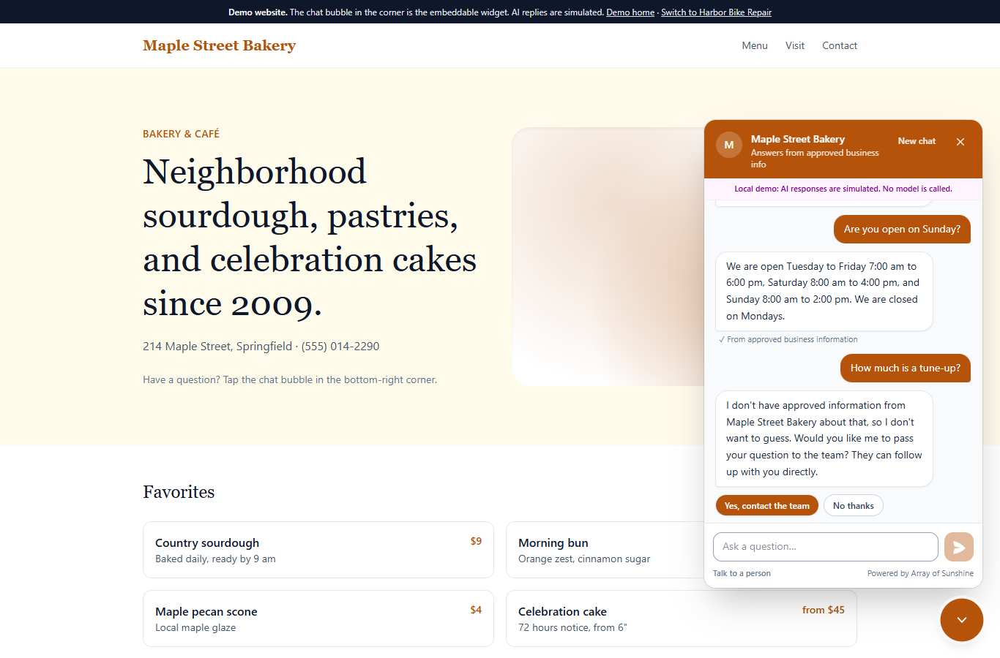
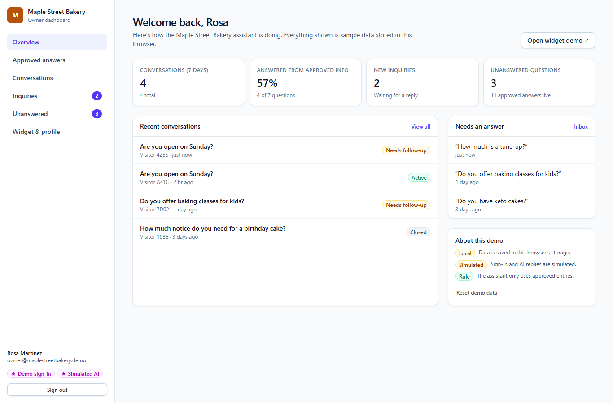
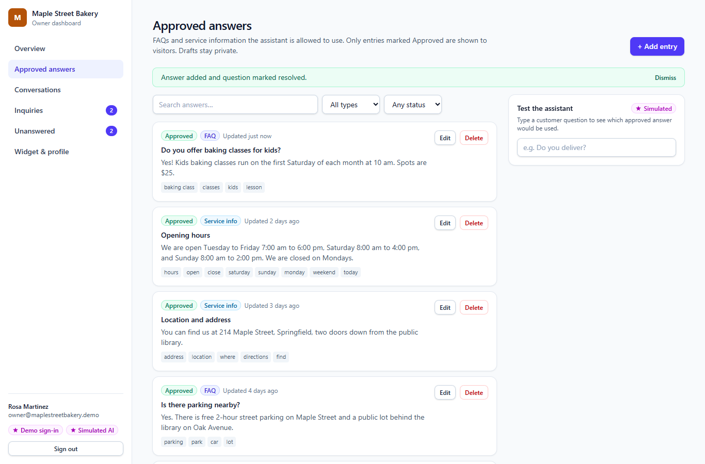
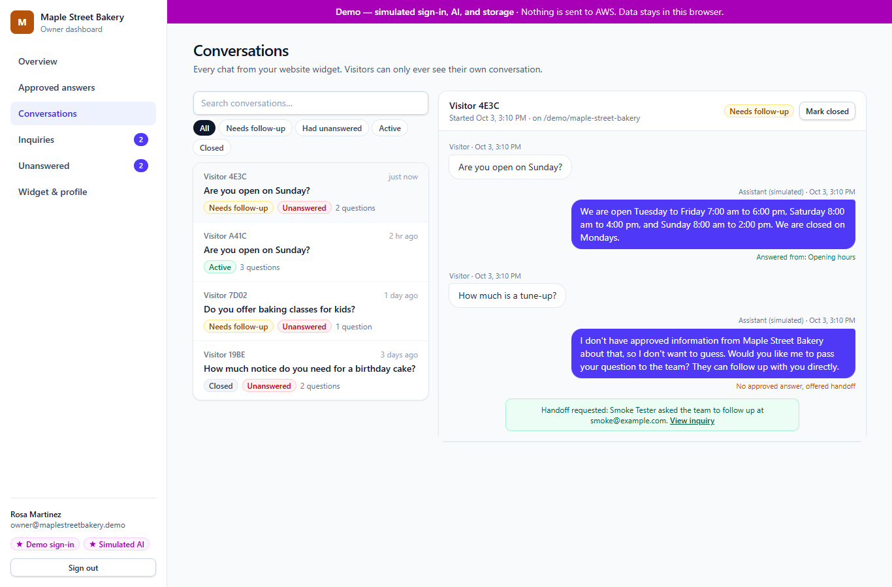
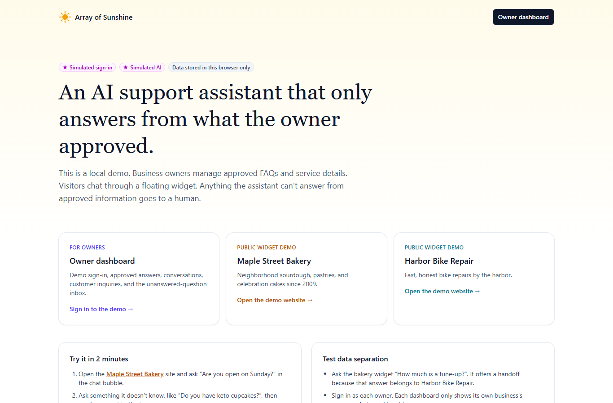
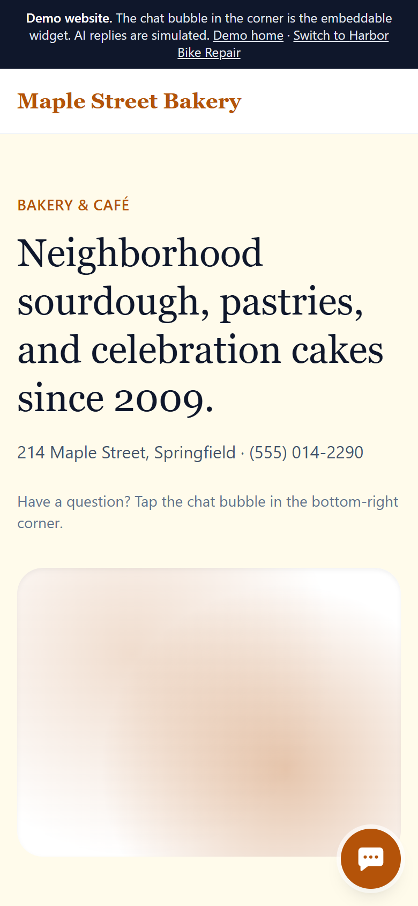
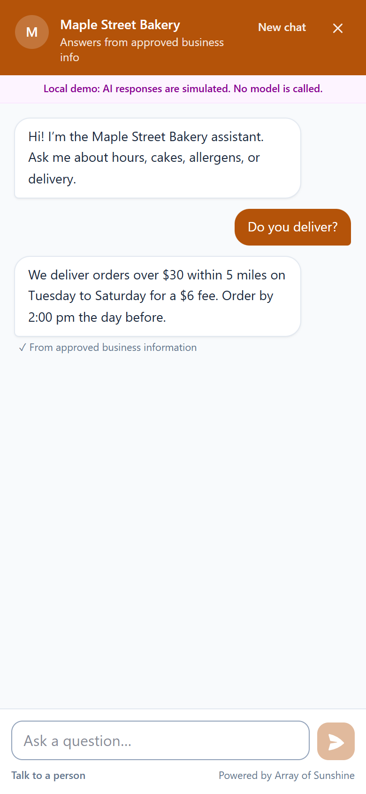
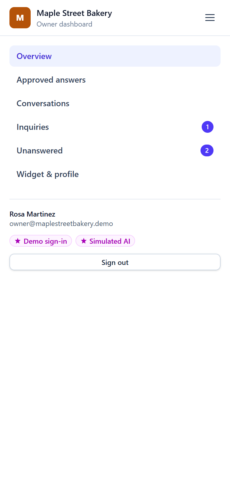

# Array of Sunshine: AI customer-support assistant

A customer-support assistant for small businesses. Owners manage **approved** FAQs and service
information in a dashboard. Visitors chat through a floating widget on the business's website.
The assistant answers **only** from approved information. For anything else, it offers to hand the
question to a person, and the question lands in the owner's unanswered-question inbox.

The goal is a support bot a small business can trust: it never invents prices, hours, or policies,
it keeps each business's data separate, and it costs a few dollars a month to run on AWS.

**Status (October 3, 2026)**

- **Local demo: working.** React 19, TypeScript, Vite 8, Tailwind CSS 4. Data is stored in the browser.
- **AWS backend: prepared, not deployed.** Amplify Gen 2 with Cognito, AppSync, Lambda, DynamoDB, S3, and Amazon Bedrock (`ConverseStream`). The code is written and type-checked, but no AWS resources have been created and no model calls have been made.
- **Cost (checked October 3, 2026):** estimated AWS usage of about **$0.53/month at 10 conversations a day** and **$1.75/month at 100 a day** (realistic case), plus about $8/month if AWS WAF is added. **Out-of-pocket cost today is $0.** The AWS account is on the Free plan with $100 in credits. The Free plan ends on April 3, 2027 or when the credits run out, whichever comes first. See [Cost and AWS account](#cost-and-aws-account).

> **Simulated in the local demo:** owner sign-in (no real security) and AI replies (no model is
> called). Both are labeled in the UI with "Demo sign-in" and "Simulated AI" badges. All data lives
> in your browser's `localStorage`. The businesses, people, emails, and phone numbers are fictional.



## Screenshots

| Owner dashboard | Approved answers |
|---|---|
|  |  |
| **Conversation transcript with handoff** | **Demo home** |
|  |  |

| Mobile website | Mobile widget (full screen) | Mobile dashboard menu |
|---|---|---|
|  |  |  |

Screenshots are produced by `npm run smoke` (see [Checks](#2-checks)).

## Features in the local demo

- **Public chat widget.** A floating widget on two sample business websites (Maple Street Bakery and Harbor Bike Repair). Replies stream word by word. On phones it opens full screen.
- **Answers only from approved information.** Grounded replies are marked "From approved business information", and the owner's transcript shows which entry each reply used. Drafts are never used. Questions with no approved answer get an honest "I don't know" plus a handoff offer.
- **Human handoff.** Visitors can leave a name, contact details, and a message. The request appears in the owner's **Inquiries** list, linked to the conversation.
- **Owner dashboard** (demo sign-in):
  - **Overview:** conversation and answer-rate stats, recent chats, and the questions that need an answer.
  - **Approved answers:** add, edit, search, filter, approve, or draft FAQs and service info. A **Test the assistant** box shows what a question will match.
  - **Conversations:** full transcripts with filters, showing which answer was used for each reply.
  - **Inquiries:** handoff requests with status tracking.
  - **Unanswered:** an inbox of questions the assistant couldn't answer. One click turns a question into a new approved answer.
  - **Widget & profile:** business name, tagline, brand color, widget greeting, contact details, and the embed snippet.
- **Data separation between businesses.** Two sample businesses with separate owners. The local owner API derives the business from the signed-in session and never accepts a business ID from the page, the same contract as the AWS backend.
- **Visitor isolation.** A visitor can read only their own conversation, using a secret visitor token.
- **Responsive layouts** for phones, tablets, and desktops. Tabs stay in sync.

---

## 1. Run the local demo (Windows PowerShell)

Prerequisites: [Git](https://git-scm.com/) and [Node.js](https://nodejs.org/) 20 or newer (tested
with Node 24.13.0 and npm 11.4.2). No AWS account is needed for the demo.

```powershell
git clone https://github.com/mustafa-sarwari/array-of-sunshine-support.git
Set-Location .\array-of-sunshine-support
npm ci

# Development server with hot reload: http://localhost:5173
npm run dev
```

Or run the production build locally:

```powershell
npm run build
npm run preview          # http://localhost:4173
```

| Page | URL (preview) |
|---|---|
| Demo home | http://localhost:4173/ |
| Maple Street Bakery website + widget | http://localhost:4173/demo/maple-street-bakery |
| Harbor Bike Repair website + widget | http://localhost:4173/demo/harbor-bike-repair |
| Open a demo site with the chat already open | add `?chat=open`, for example http://localhost:4173/demo/maple-street-bakery?chat=open |
| Owner sign-in (demo) | http://localhost:4173/owner/sign-in |

**Demo owner accounts** (simulated; the sign-in page has one-click buttons). These are not real
credentials. They exist only in the browser demo.

| Business | Email | Password |
|---|---|---|
| Maple Street Bakery | `owner@maplestreetbakery.demo` | `demo-bakery` |
| Harbor Bike Repair | `owner@harborbikes.demo` | `demo-bikes` |

To start over, use **Reset demo data** on the home page or the dashboard overview.

### Two-minute walkthrough

1. Open the Maple Street Bakery site and ask "Are you open on Sunday?". The answer comes from the approved hours entry.
2. Ask "Do you have keto cupcakes?". The assistant says it has no approved information and offers a handoff. Click **Yes, contact the team** and send the form.
3. In another tab, sign in as the bakery owner. The question appears under **Unanswered**, and the request appears under **Inquiries**.
4. On **Unanswered**, click **Write approved answer**, save it, then ask the widget again (use **New chat**).

### Testing data separation

- Ask the bakery widget "How much is a tune-up?". It refuses, because that answer belongs to Harbor Bike Repair.
- Sign in as each owner. Each one sees only their own answers, conversations, inquiries, and unanswered questions.
- The bakery's "Holiday pie pre-orders" entry is a **draft**. The widget never uses it until it is approved.

## 2. Checks

```powershell
npm run check            # frontend typecheck + Amplify backend typecheck + unit tests + production build
npm run test             # unit tests only (retrieval, data separation, visitor isolation)
npm audit --omit=dev     # audit of the packages shipped to the browser
```

End-to-end browser test. It uses your installed Microsoft Edge, so nothing is downloaded. Start
the preview in one PowerShell window and run the test in another:

```powershell
# Window 1
npm run build
npm run preview

# Window 2
npm run smoke            # saves screenshots to docs/screenshots/
```

`npm run smoke` drives the real UI on desktop and mobile. It chats with the widget, submits a
handoff, signs in as both owners, turns an unanswered question into an approved answer, confirms
the widget uses it, and checks that neither owner can see the other's data. To use Chrome instead
of Edge, run `$env:BROWSER_CHANNEL = "chrome"` first.

---

## 3. How it works

### Answering rules (local and AWS)

`shared/retrieval.ts` scores the visitor's question against the business's **approved** entries
using keywords, synonyms, and a minimum match score. The same code runs in the local demo and in
the production Lambda.

- **No match:** reply with the handoff message, record an unanswered question, and **skip the model**. This avoids guessing and avoids model cost.
- **Match (AWS only):** send only the top 5 matching approved entries to Bedrock. The system prompt (`shared/prompt.ts`) tells the model to answer only from those entries, or to reply with `[[HANDOFF]]`. The Lambda holds back that sentinel so visitors never see it, then turns it into a handoff.
- **Match (local demo, simulated AI):** reply with the approved answer text itself, streamed word by word to mimic `ConverseStream`.

### AWS backend architecture (prepared, not deployed)

> **Not deployed.** The backend in `amplify/` has been written and type-checked only. It has not
> been synthesized, deployed, or tested against AWS. Expect small fixes on the first deployment.

```
Business website ──(widget.js, public widget key)──► Lambda function URL: public-chat
                                                     │  RESPONSE_STREAM, NDJSON events
                                                     ├─► DynamoDB (single table, on-demand)
                                                     └─► Amazon Bedrock ConverseStream (Nova Lite)

Owner dashboard ──(Cognito sign-in)──► AWS AppSync (userPool auth only) ──► Lambda: owner-api
                                                                             ├─► DynamoDB
                                                                             └─► S3 presigned URLs

Amplify Hosting serves the dashboard and widget.js
```

| AWS service | Role |
|---|---|
| Amazon Cognito | Owner sign-in (email, optional TOTP MFA, admin-invite only) |
| AWS AppSync | Owner API, Cognito user pool auth only, custom queries and mutations backed by `owner-api` |
| AWS Lambda | `owner-api` (AppSync resolver) and `public-chat` (streaming function URL for the widget) |
| Amazon DynamoDB | One on-demand table for businesses, entries, conversations, inquiries, and rate limits (TTL, point-in-time recovery) |
| Amazon S3 | Private bucket for owner documents, reached only through short-lived presigned URLs |
| Amazon Bedrock | `ConverseStream` with Amazon Nova Lite, called only from the `public-chat` Lambda |
| AWS Amplify Gen 2 | Infrastructure as code (`amplify/`) and hosting |

### Security model

| Rule | How it's enforced |
|---|---|
| Owner's business comes from identity, never the browser | The AppSync API requires a Cognito user pool token. The `owner-api` Lambda reads `event.identity.sub`, looks up `USER#<sub> / MEMBERSHIP`, and uses that `businessId`. No GraphQL operation has a `businessId` argument. Every record is addressed under `BIZ#<businessId>`, so another business's ids simply miss. |
| Owners can't self-register | `allowAdminCreateUserOnly` is set on the user pool. An admin invites owners and links them with `scripts/provision-business.ts`. |
| The public widget can't see private data | The widget calls a separate Lambda function URL, never AppSync, which has no API key and no guest access. The function only accepts a public widget key, which it maps to a business on the server. It can read approved entries for matching only. It can start a conversation, then read or append to that conversation only with the secret visitor token it was given. The token is stored as a SHA-256 hash and compared in constant time. It cannot list conversations or read drafts, inquiries, or documents. |
| Documents stay private | The S3 bucket has no client access rules. The owner API issues 5-minute presigned upload URLs under `businesses/<businessId>/…`, using the business id derived from identity. The widget has no route to the bucket. |
| Credentials and model calls stay on the backend | Bedrock is called only from the `public-chat` Lambda's IAM role. That role is scoped to one model ARN with `bedrock:InvokeModelWithResponseStream` and `bedrock:InvokeModel`. The browser never holds AWS credentials. |
| Abuse and cost limits | Per-IP rate limit (20 requests/minute, counted in DynamoDB with TTL), per-business origin allow-list, function URL CORS, 500-character messages, 40 messages per conversation, `maxTokens` 400, optional reserved concurrency. Conversations and messages expire after 180 days (DynamoDB TTL). |

### Model choice

Recommended model: **Amazon Nova Lite** (`amazon.nova-lite-v1:0`). On October 3, 2026, read-only
calls confirmed it is `ACTIVE`, supports on-demand invocation in `us-east-2`, and supports
streaming. It costs $0.06 per 1M input tokens and $0.24 per 1M output tokens in us-east-2.
It is also the only candidate that runs in-Region, which matters because the AWS Free plan doesn't
support cross-Region inference profiles.

To change the model, set `BEDROCK_MODEL_ID` before deploying. If you choose a cross-region
inference profile ID (for example `us.amazon.nova-micro-v1:0`, Paid plan only), also update the
IAM resources in `amplify/backend.ts` as its comment describes.

Re-check model availability at any time (read-only, no charges):

```powershell
aws bedrock list-foundation-models --region us-east-2 --profile aws-project `
  --query "modelSummaries[?contains(modelId,'nova')].[modelId,modelLifecycle.status,join(',',inferenceTypesSupported)]" --output table
aws bedrock list-inference-profiles --region us-east-2 --profile aws-project `
  --query "inferenceProfileSummaries[?contains(inferenceProfileId,'nova')].inferenceProfileId" --output table
```

### Cost and AWS account

Checked on October 3, 2026 with read-only AWS calls. Full details, assumptions, and the costs
not included are in [COST_ESTIMATE.md](COST_ESTIMATE.md).

| | 10 conversations/day | 100 conversations/day |
|---|---|---|
| Estimated AWS usage cost, realistic | ≈ $0.53/month | ≈ $1.75/month |
| Estimated AWS usage cost, conservative upper bound | ≈ $1.62/month | ≈ $3.83/month |
| With AWS WAF added | + ≈ $8/month | + ≈ $8/month |
| **Out-of-pocket payment on the Free plan** | **$0** | **$0** |

- **Usage cost vs. payment.** Usage cost is what AWS meters. On the Free plan, it is deducted from the account's $100 in credits, and nothing is charged to a card.
- **Free plan expiry.** The Free plan ends on **April 3, 2027**, or earlier if the credits run out. The account then closes and the app stops working. You have 90 days to upgrade to the Paid plan before AWS permanently deletes the account and its data.
- **After upgrading.** Remaining credits apply to bills until about October 2027, which is 12 months after the account was opened. After that, you pay the usage cost.
- **Credits outlast the Free plan.** At the estimated rates, the credits last longer than the plan in every scenario, so the date is what ends it. Upgrade before April 3, 2027 if the app should keep running.
- **No budget alert is configured yet.** COST_ESTIMATE.md has the command. Run it before going live or right after upgrading.
- **Always free.** Lambda, Cognito, and CloudWatch usage at these volumes is within AWS's always-free monthly allowances.

### Project layout

```
amplify/                    Amplify Gen 2 backend (prepared, not deployed)
  backend.ts                DynamoDB table, IAM, function URL, Cognito hardening, outputs
  auth/resource.ts          Cognito user pool (owners only, email sign-in, optional TOTP MFA)
  data/resource.ts          AppSync schema: owner-only custom queries/mutations → owner-api
  storage/resource.ts       Private S3 bucket for owner documents
  functions/owner-api/      AppSync Lambda resolver (business derived from Cognito sub)
  functions/public-chat/    Public streaming chat endpoint (Bedrock ConverseStream)
  functions/lib/table.ts    Single-table key layout and helpers
shared/                     Retrieval and prompt code shared by the demo and the Lambda
src/
  components/ChatWidget.tsx Floating public widget
  lib/ownerApi.ts           Local stand-in for owner-api (same no-businessId contract)
  lib/publicApi.ts          Local stand-in for public-chat (widget key + visitor token)
  lib/simulatedAi.ts        Simulated assistant (no model calls)
  lib/demoAuth.ts           Simulated sign-in
  lib/seed.ts               Fictional sample data: Maple Street Bakery and Harbor Bike Repair
  pages/                    Home, demo websites, owner dashboard pages
scripts/smoke.mjs           End-to-end browser test
scripts/provision-business.ts  Links a Cognito owner to a business and loads sample data in AWS
.env.example                Placeholder names for the backend settings (no real values)
```

---

## 4. Deploying to AWS (not run yet)

> **Not run yet.** Every command in this section creates AWS resources or makes paid calls,
> except the first one. At demo scale, usage costs cents per month, and on the Free plan it is
> paid from credits (see [Cost and AWS account](#cost-and-aws-account)). The commands assume an AWS CLI profile named
> `aws-project` that already has credentials (for example from `aws configure sso` or
> `aws login`). Don't put access keys in this repository; `.env.example` lists the setting
> names only.

```powershell
# 0. Confirm the identity and account (read-only)
aws sts get-caller-identity --profile aws-project

# 1. Settings used when the backend is synthesized
$env:AWS_REGION = "us-east-2"
$env:AWS_PROFILE = "aws-project"
$env:BEDROCK_MODEL_ID = "amazon.nova-lite-v1:0"
$env:WIDGET_ALLOWED_ORIGINS = "http://localhost:5173,http://localhost:4173"
# Optional cost circuit breaker; skip on accounts whose Lambda concurrency quota is 10:
# $env:PUBLIC_CHAT_RESERVED_CONCURRENCY = "5"

# 2. One-time CDK bootstrap of the account/region (creates resources)
$accountId = aws sts get-caller-identity --profile aws-project --query Account --output text
npx aws-cdk@latest bootstrap "aws://$accountId/us-east-2" --profile aws-project

# 3. Personal cloud sandbox: deploys the backend and writes amplify_outputs.json
#    (creates resources; leave it running, Ctrl+C to stop watching)
npx ampx sandbox --profile aws-project --identifier dev
```

After the sandbox is up, in a second PowerShell window in the project folder:

```powershell
$env:AWS_REGION = "us-east-2"; $env:AWS_PROFILE = "aws-project"

# 4. Read the generated outputs (amplify_outputs.json is git-ignored)
$out = Get-Content .\amplify_outputs.json -Raw | ConvertFrom-Json
$poolId = $out.auth.user_pool_id
$table  = $out.custom.supportTableName
$out.custom.publicChatUrl

# 5. Invite the bakery owner (Cognito emails a temporary password; use an inbox you control)
aws cognito-idp admin-create-user --user-pool-id $poolId --username "owner@maplestreetbakery.example" `
  --user-attributes Name=email,Value=owner@maplestreetbakery.example Name=email_verified,Value=true
$sub = aws cognito-idp admin-get-user --user-pool-id $poolId --username "owner@maplestreetbakery.example" `
  --query "UserAttributes[?Name=='sub'].Value | [0]" --output text

# 6. Link the owner to the business and load the sample answers (preview first with --dry-run)
npx tsx scripts/provision-business.ts --table $table --business maple --owner-sub $sub `
  --origins "http://localhost:5173,http://localhost:4173" --dry-run
npx tsx scripts/provision-business.ts --table $table --business maple --owner-sub $sub `
  --origins "http://localhost:5173,http://localhost:4173"

# 7. First paid model call (fractions of a cent): start a chat and ask one question
$url  = $out.custom.publicChatUrl
$hdrs = @{ Origin = "http://localhost:5173" }
$start = Invoke-RestMethod -Method Post -Uri $url -Headers $hdrs -ContentType "application/json" `
  -Body '{"action":"start","widgetKey":"pk_demo_maple_7c1f2a"}'
$body = @{ action = "message"; widgetKey = "pk_demo_maple_7c1f2a"; conversationId = $start.conversationId;
           visitorToken = $start.visitorToken; text = "Are you open on Sunday?" } | ConvertTo-Json
Invoke-WebRequest -Method Post -Uri $url -Headers $hdrs -ContentType "application/json" -Body $body -UseBasicParsing |
  Select-Object -ExpandProperty Content
```

Repeat steps 5 and 6 with `--business harbor` for the second business.

**Tear down the sandbox.** The DynamoDB table is retained on purpose so data isn't lost by
accident. Delete it separately once you are sure:

```powershell
npx ampx sandbox delete --profile aws-project --identifier dev --yes
aws dynamodb delete-table --table-name $table --region us-east-2 --profile aws-project
```

**Production hosting.** In the Amplify console, choose **Create new app → Deploy with Git**,
connect this GitHub repository, and pick region `us-east-2`. Set the `BEDROCK_MODEL_ID` and
`WIDGET_ALLOWED_ORIGINS` environment variables, then deploy.

---

## 5. Remaining work before production

1. **Connect the frontend to AWS.** Replace `src/lib/ownerApi.ts` with the Amplify Data client (`generateClient<Schema>()`) and Cognito sign-in (`aws-amplify` / Authenticator). Replace `src/lib/publicApi.ts` with `fetch` calls to `publicChatUrl` that read the NDJSON stream. Remove `demoAuth.ts` and the local seed data.
2. **Build the embeddable `widget.js`.** Make it a separate small library build (target ~40 KB gzipped) that renders inside a Shadow DOM, so it can't clash with the host site's CSS, and fetches config only when the chat is opened.
3. **Deploy to a sandbox and run integration tests.** The backend has only been type-checked; it has not been synthesized or deployed. Expect to fix small issues on the first `ampx sandbox`. Then test the owner API with two owners, try cross-business access, try visitor-token guessing, and run the rate limiter under load.
4. **Evaluate answer quality on Bedrock.** Build a test set of approved questions, unapproved questions, and prompt-injection attempts. Tune the retrieval threshold and prompt. Consider Amazon Bedrock Guardrails (prompt-attack filter, denied topics).
5. **Put CloudFront and AWS WAF in front of the public function URL.** Add a rate-based rule and managed rule groups (~$8/month), plus bot protection or a CAPTCHA on the handoff form.
6. **Set cost and health alerts.** No budget exists yet. Add an AWS Budgets alert (command in COST_ESTIMATE.md) and CloudWatch alarms for Lambda errors and throttles and for Bedrock throttling.
7. **Decide on the AWS plan before April 3, 2027.** The account is on the Free plan, which closes the account on that date or when the $100 in credits runs out. Upgrade to the Paid plan to keep the app running. Remaining credits carry over.
8. **Owner onboarding.** Replace the provisioning script with an admin-only invite flow, and decide how businesses and widget keys are created and rotated.
9. **Notify owners about new inquiries.** For example, email through Amazon SES. Today inquiries only appear in the dashboard.
10. **Privacy and compliance.** Add a privacy notice and an "AI assistant" disclosure in the widget. Confirm the 180-day retention period with the business, add a data-deletion process, review whether inquiry PII needs a customer-managed KMS key, and keep visitor text out of logs (handlers currently log only error names).
11. **Documents.** Uploads are stored privately but are **not** used for answers, by design. If you want it, add an "extract into draft entries" flow that still requires owner approval.
12. **Custom domain and allowed origins.** Attach the production domain in Amplify Hosting, and update `WIDGET_ALLOWED_ORIGINS` and each business's `allowedOrigins`.
13. **Accessibility and browser QA.** Run a screen-reader pass and test Safari on iOS (the widget is full screen on phones).
14. **Dependency hygiene.** See [Dependency audit](#dependency-audit). Re-run `npm audit` after Amplify and CDK releases, and remove the `overrides` in `package.json` once upstream packages ship the fixes.

### Dependency audit

`npm audit --omit=dev` reports **0** vulnerabilities, so nothing shipped to the browser is affected.
The full `npm audit` reports **36** findings (33 high, 3 moderate), all inside developer tools used
when synthesizing or generating the AWS backend (`@aws-amplify/backend`, `@aws-amplify/backend-cli`,
`aws-cdk-lib`). They don't run in the browser app or in the Lambda bundles. They come from three
packages that have no compatible fix yet:

| Package | Issue | Why it isn't fixed here |
|---|---|---|
| `braces` 3.0.3 | Denial of service from deeply nested glob patterns | No patched release exists. Reached through `micromatch` and `fast-glob` in the CDK and Amplify CLI tooling. Patterns come from the project's own code, not from visitors. |
| `brace-expansion` 5.0.9 | Denial of service from crafted brace patterns | Bundled inside `aws-cdk-lib` 2.272.0, the latest release, so npm can't override it. Only matches the project's own asset paths at synth time. |
| `csv-parse` 5.6.0 | Prototype pollution through the `columns` option | Fixed only in a new major version (7.x). Used only by `ampx generate schema-from-database`, which this project doesn't use. |

Three other vulnerable packages are fixed with scoped `overrides` in `package.json`, staying
within the same major version: `lodash` 4.18.1, `immutable` 3.8.4, and `mysql2` 3.24.5. This took
the count from 46 to 36. Don't run `npm audit fix --force`. It "fixes" the rest by downgrading
`@aws-amplify/backend-cli` to 0.11.1, which is a breaking change.

## 6. Known limitations of the local demo

- Simulated sign-in is not security. Anyone using the browser can pick either account.
- Simulated answers return the approved text verbatim. The production Lambda lets Bedrock phrase the answer from the same entries.
- Retrieval is keyword-based. Unusual wording can miss an approved answer, in which case the visitor is offered a handoff. The owner's **Test the assistant** box shows what will match.
- All data stays in this browser. Clearing site data resets it.
